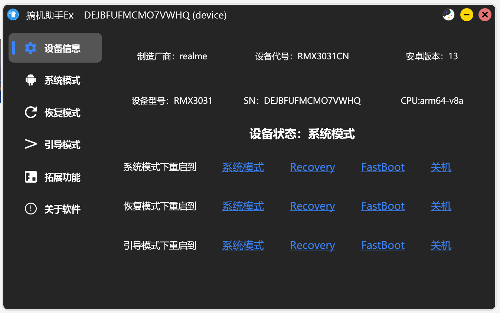
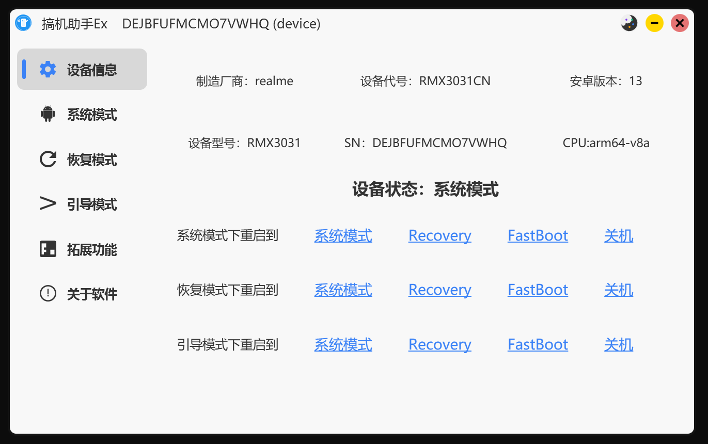

# 软件介绍

目前待开发功能有：
- Twrp recovery全自动刷机
- 免Root冻结、卸载预装软件
- 免Root激活
- 反向共享PC网络
- 刷入Recovery
- 小米线刷
- 无线ADB连接
- Sideload刷机
- ADB文件浏览器
- 应用下载及安装
- 推送任意格式文件

更多功能和玩法等你来反馈。

## 问题排查

无法检测到设备时请确认设备USB调试开关是否打开，如果确认USB调试开关打开仍无法连接请下载安卓驱动并安装，安装后可能需要重启软件才能检测到设备。

## 软件截图

## 联系我们

QQ群：756014603
